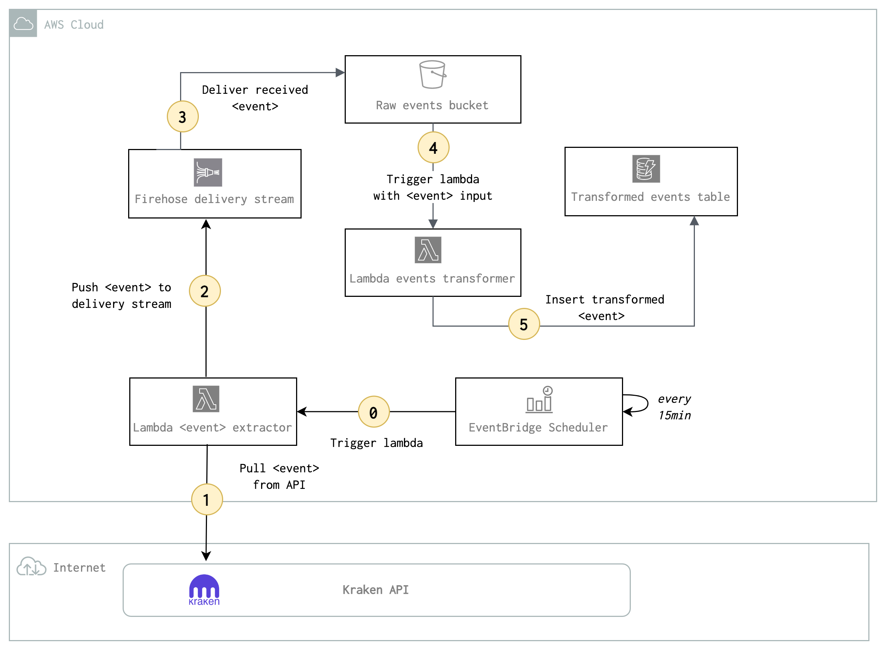

# e2e-streaming-pipeline

# Purpose 
* The purpose of the project is to provide a generic blueprint for a **serverless** end-to-end streaming pipeline, demonstrating the potential for scalable & resilient architectures using AWS managed services. 
* The outline of the solutions architecture is simple : provide a streaming interface that receives continuous data events, then proceed to store each event at both raw & transformed format in the adequate storage technology for each.
* The project also demonstrates how straightforward it is to schedule a python job in AWS using Evenbridge Scheduler & Lambda 
* Every piece of the architecture is scripted using Terraform.

# Architecture

0. EventBridge scheduler trigger a lambda every 15 minutes 
1. Lambda extracts data from API 
2. Lambda pushes the response to Firehose 
3. Firehose delivers the event to a S3 bucket
4. Upon event delivery on S3, another lambda is triggered 
5. Lambda trasnforms the event in the required format and store the result in DynamoDB

# Use case 
* The code in `src` applies the the e2e steaming pipeline blueprint to the context of bitcoin market data. 
* The purpose is to fetch bitcoin asks/bids market data from Kraken's API. 
* Each event (bitcoin asks/bids) is stored as-is and then transformed to a more functional-ready format accessible in a queryable storage. 
* The transformation process calculates on the fly  the estimated price from asks/bids, as well as average/median ask/bif. 
